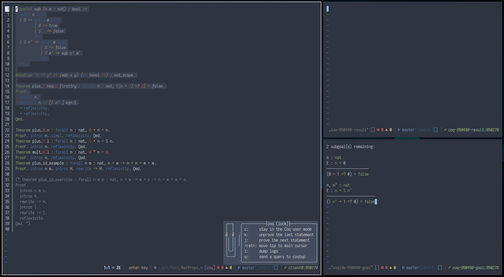

This plugin aims at providing a functional and usable `coqidetop` wrapper for use with Kakoune.



For a list of things left to do, see the end of this README.

-----------------

P.S.: [coqoune](https://github.com/guest0x0/coqoune) is the same kind of project, and was started way before this one.
However, in my experience, Coqoune has been a bit buggy at some times (for example crashing on Coq errors), and the overall integration with highlighters doesn't work that well.
I wanted to maintain a fork on my own, but most of the extension is written in some weird non-POSIX shell, which I'm not that familiar with at all.

I chose to write the “backend” in Rust, mainly to discover, and because I felt like it was more suited for this than Haskell.

## Dependencies

- coqidetop (should come with a Coq installation by default)
- [socat](https://linux.die.net/man/1/socat)
- Python 3.8+

## Installation

The recommended way to install this plugin is through [plug.kak](https://github.com/andreyorst/plug.kak):
```sh
plug "mesabloo/coqide.kak" do %{
  cargo build --release --locked
  cargo install --force --path . --root ~/.local
} config %{
  # configure this plugin here
}
```

## Public API

- `coqide-start` starts the daemon in the current buffer.
  Note that multiple daemons defined in multiple buffers account for multiple sessions.
  The state is also bufferized, meaning that you cannot control one daemon from another buffer than the one
  it was started for.
- `coqide-stop` stops the daemon started in the current buffer.
- `coqide-dump-log` starts a new buffer with the logs until this point.
  It is not automatically refreshed when new logs appear.
  In order to do this, you need to close the log buffer with `delete-buffer!` and relaunch `coqide-dump-log`.
- `coqide-next` identifies and processes the next Coq statement.
- `coqide-previous` removes the last processed Coq statement from the processed state.
- `coqide-query` prompts for a query to send directly to the `coqidetop` process and sends it without affecting the current state.
- `coqide-move-to` tries to process Coq statements until the main cursor.
- `coqide-hints` asks the daemon for hints for the current proof.
  These may not necessarily be meaningful or useful at all, but this command is provided just in case.
- `coqide-goto-tip` moves the cursor 

Additional functionality:
- This plugin will also automatically backtrack to the cursor when an insertion is detected before the end of the processed range.

## Documentation

This plugin comes with several default options, but some of them can be altered:

- `coqide_command` is the command used to launch the daemon (which is written in Rust).
  Sometimes, the executable is not in your PATH, so you may want to customize this option using `set-option global coqide_command "<path to coqide-daemon>"`.
  The default value is `coqide-daemon` therefore assumes it is in your PATH.
- **Colors:**
  - Ranges:
    - `coqide_processed_face` is the `face` used to highlight Coq code which has already been processed by the daemon.
      This can be customized as wanted using `set-face`, but comes with the default value `default,green`.
    - `coqide_error_face` is the `face` used to highlight errors in the Coq buffer.
      It defaults to `default,red` and can be customized with `set-face`.
    - `coqide_to_be_processed_face` is the `face` used to color code which is yet to be processed by the daemon.
      Defaults to `default,magenta` to be as close as possible to default CoqIDE colors.
    - `coqide_admitted_face` is the `face` used to highlight parts of the code which contain admitted proofs, as in CoqIDE.
      This defaults to `default,yellow` so as to be visual and mimic CoqIDE.
    - `coqide_error` is the `face` used to color the error messages in the result buffer.
      Defaults to `red+b` for consistency with `coqide_error_face`.
    - `coqide_warning` is the `face` used to color the warning messages in the result buffer.
      Defaults to `yellow+b`.
  - Code coloring:
    - `coqide_keyword` is the `face` used to color keywords in both goal and result buffers.
      It defauls to the same face used to color `keyword`s.
    - `coqide_evar` is used to highlight specific variables in the goal and result buffers.
      Defaults to `variable` when not specified.
    - `coqide_type` is the face which colors types in the goal and results buffers.
      Defaults to the face `type` if unchanged.
    - `coqide_notation` colors operators in both goal and result buffers.
      Defaults to `operator` if left unspecified.
    - `coqide_variable` is used to highlight variable names in the goal and result buffers.
      Defaults to `variable` if unchanged.
    - `coqide_reference` ???
      Defaults to `variable` because I'm quite unsure what this is used for.
    - `coqide_path` ???
      Defaults to `module` for some reason.

## Things left to do and known bugs

The codebase is at some locations pretty ugly (e.g. when decoding XML nodes to Rust values).
However, most of it should be at last a little bit documented.

Here are some erroneous or incomplete features:
- Modifying the buffer in normal mode (e.g. by pressing `d`) before the tip does not correctly work
  as Kakoune modifies ranges before the backend as any chance to remove those.
  This also may happen sometimes in insert mode.

  A workaround for now is to backtrack by hand until before your cursor.
- Output `Ready in ..., proving ...` in an info box at all time, in normal mode.
- Create a `coqide-version` which returns the version of Coq and the XML protocol.
- Color admitted ranges in yellow.
- Bugs are yet to be found! If you find any, please report them.

If you feel like it, feel free to improve this plugin by forking this repository and submitting your patches through pull requests.
Just try not to implementi too many features in the same pull request (two is acceptable, if small).

## Personal configuration

As I intend to use this plugin, here is how I configured it.
It spawns two new kakoune clients containing the result and goal buffers and deletes them when the master buffer gets discarded.

```kak
plug "coqide.kak" do %{
  cargo build --release --locked
  cargo install --force --path . --root ~/.local
} config %{
  declare-option -hidden str coqide_close_panels

    declare-user-mode coq
    map global coq c ": enter-user-mode -lock coq<ret>" \
      -docstring "stay in the Coq user mode"
    map global coq k ": coqide-previous<ret>" \
      -docstring "unprove the last statement"
    map global coq j ": coqide-next<ret>" \
      -docstring "prove the next statement"
    map global coq <ret> ": coqide-move-to<ret>" \
      -docstring "move tip to main cursor"
    map global coq l ": coqide-dump-log<ret>" \
      -docstring "dump logs"
    map global coq q ": coqide-query<ret>" \
      -docstring "send a query to coqtop"

  # Create two additional clients to show goals and results
  hook global BufCreate (goal|result)-(.*) %{
    evaluate-commands %sh{
      client_name="${kak_hook_param_capture_1}-${kak_hook_param_capture_2}"
      regex_safe="$(sed 's/\*/\\*/g' <<< "$kak_hook_param_capture_0")"

      switch_to_buffer="
        buffer $kak_hook_param_capture_0
        rename-client $client_name

        try %{
          remove-highlighter buffer/line_numbers
          remove-highlighter buffer/matching
          remove-highlighter buffer/wrap_lines
          remove-highlighter buffer/show-whitespaces
        }
      "
      ${kak_opt_termcmd} "kak -c $kak_session -e '$switch_to_buffer'" &>/dev/null </dev/null &

      echo "hook -once global BufClose '$regex_safe' %{
        evaluate-commands -client '$client_name' 'quit!'
      }"
    }
  }


  hook global WinSetOption filetype=coq %{
    require-module coqide
    coqide-start

    # User mode to interact with CoqIDE only in Coq files
    map buffer user c ": enter-user-mode coq<ret>" \
      -docstring "enter the Coq user mode"

    # Better looking face
    set-face global coqide_processed default,black+id

    # Commands to execute when the buffer is closed.
    # These are declared here as a string in order to have the value of `%opt{coqide_pid}`
    # (which is an internal option)
    set-option buffer coqide_close_panels "
      evaluate-commands -client goal-%opt{coqide_pid} 'quit!'
      evaluate-commands -client result-%opt{coqide_pid} 'quit!'
      remove-hooks coqide-%opt{coqide_pid}
    "

    # Remove the side panels when closing the buffer
    hook global -group "coqide-%opt{coqide_pid}" BufClose "%val{buffile}" %{ try %opt{coqide_close_panels} }
    hook global -group "coqide-%opt{coqide_pid}" ClientClose .* %{ try %opt{coqide_close_panels} }
  }
}
```
